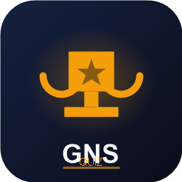

# 🎓 GNS Quiz Manager



> **The Ultimate Quiz Battle System for GNS School IT Day**  
> A powerful, modern, and interactive desktop application designed to manage school quiz competitions seamlessly. Built with **Electron.js** and **Tailwind CSS**.

  

---

## 🚀 Overview

**GNS Quiz Manager** is a fully feature-rich application built to handle the complexities of a live quiz competition. From registering teams and managing a question bank to hosting nail-biting 1v1 battles with real-time scoring, this tool handles it all.

Whether it's a small classroom quiz or a school-wide IT Day competition, GNS Quiz Manager ensures a smooth, engaging, and visually stunning experience.

---

## ✨ Key Features

### 🏆 Team Management

- **Easy Registration:** Add school names and team members effortlessly.
- **Limit Control:** Supports up to 10 teams for tournament-style play.
- **Live Management:** Edit or remove teams on the fly.

### ❓ Question Bank System

- **CRUD Operations:** Create, Read, Update, and Delete questions easily.
- **Bulk Import/Export:** Save your question bank as JSON or import questions from previous events.
- **Secure Handling:** Prevents duplicate questions automatically during matches.

### ⚔️ The Battle Arena (1v1 Matches)

- **Smart Matchmaking:** Uses **Fisher-Yates Shuffle** algorithm to generate fair, random match pairings.
- **Turn-Based Gameplay:** Interactive UI where teams take turns answering.
- **Visual & Audio Cues:**
  - ⏳ **Dynamic Timer:** 30s countdown with color shift (Green ➔ Yellow ➔ Red).
  - � **Sound Effects:** Professional "Ding" for correct answers and "Buzz" for wrong ones.
  - 🛑 **Sudden Death:** Automatic tie-breaker mode if scores are level.

### 📊 Real-Time Analytics

- **Live Leaderboard:** Updates instantly after every match.
- **Winner Podium:** Celebratory view for the champions.
- **Match History:** Detailed logs of past battles for transparency.
- **Printable Results:** Export final standings for official records.

### 🎨 Modern UI/UX

- **Dark Mode Aesthetic:** Sleek, high-contrast design optimized for projectors and large screens.
- **Responsive Animations:** Powered by Tailwind CSS for smooth transitions.
- **Portable:** Runs as a standalone Windows executable (`.exe`)—no installation required!

---

## 🛠️ Tech Stack

- **Core:** [Electron.js](https://www.electronjs.org/) (Main Process)
- **Frontend:** HTML5, JavaScript (Vanilla ES6+)
- **Styling:** [Tailwind CSS](https://tailwindcss.com/) (v3 via CDN)
- **Data Store:** Local JSON Storage (Custom `store.js` implementation)
- **Build Tool:** `electron-builder`

---

## 📸 Screenshots

|             Dashboard             |        Match Interface        |
| :-------------------------------: | :---------------------------: |
| _(Add Dashboard Screenshot Here)_ | _(Add Match Screenshot Here)_ |

|       Question Bank        |         Winner Podium          |
| :------------------------: | :----------------------------: |
| _(Add QB Screenshot Here)_ | _(Add Podium Screenshot Here)_ |

---

## ⚡ Installation & Setup

Want to run this locally? Follow these steps:

### Prerequisites

- [Node.js](https://nodejs.org/) (LTS Version recommended)
- [Git](https://git-scm.com/)

### 1. Clone the Repository

```bash
git clone https://github.com/YourUsername/GNS-Quiz-Manager.git
cd GNS-Quiz-Manager
```

### 2. Install Dependencies

```bash
npm install
# or
yarn install
```

### 3. Run Developer Mode

```bash
npm start
# or
yarn start
```

### 4. Build for Windows

To create the portable `.exe` file:

```bash
npm run build
```

_The output file will be in the `dist/` directory._

---

## 🎮 How to Use

1. **Dashboard:** Start by clicking "Manage Teams" to register participating schools.
2. **Questions:** Go to "Manage Questions" to add your MCQs. Ideally, add at least 30 questions.
3. **Generate Matches:** On the Dashboard, click "Shuffle & Generate Pairs".
4. **Start Battle:** Click "Start Match" on a pairing.
   - Teams take turns choosing options.
   - Timer auto-starts.
   - Scores update automatically.
5. **Winner:** Once all matches are done, the Leaderboard will highlight the Champions! 🏆

---

## 📂 Project Structure

```
GNS-Quiz-Manager/
├── assets/             # Icons, Sounds (ding.mp3, buzz.mp3)
├── dist/               # Built executables (Auto-generated)
├── index.html          # Main UI entry point
├── main.js             # Electron Main Process (Window, IPC)
├── preload.js          # Security Bridge (Context Isolation)
├── renderer.js         # Frontend Logic (UI Interactions)
├── store.js            # Data persistence layer
├── package.json        # Project metadata & scripts
└── README.md           # Project Documentation
```

---

## 🤝 Contributing

Contributions are welcome! If you have ideas to make this better:

1. Fork the Project
2. Create your Feature Branch (`git checkout -b feature/AmazingFeature`)
3. Commit your Changes (`git commit -m 'Add some AmazingFeature'`)
4. Push to the Branch (`git push origin feature/AmazingFeature`)
5. Open a Pull Request

---

## 📜 License

Distributed under the **MIT License**. See `LICENSE` for more information.

---

### ❤️ Built for GNS School IT Day

_Crafted with precision and passion._
